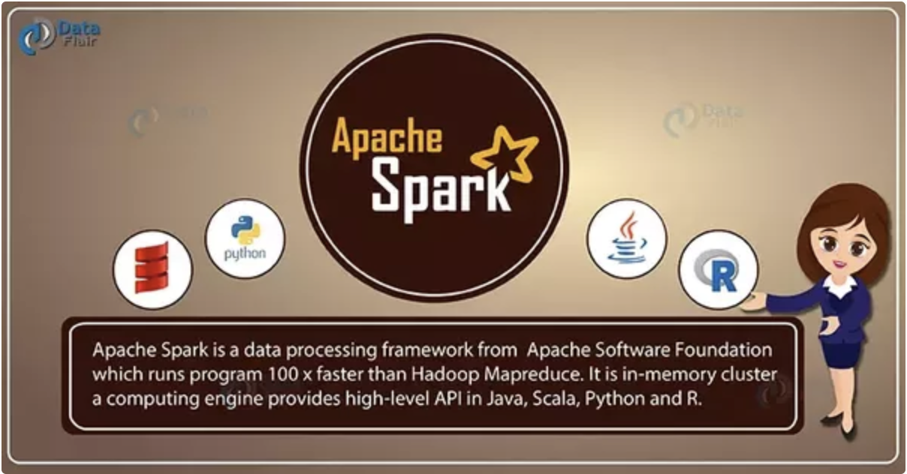

***

0

***

Install R

Install RStudio

Install Java

Download a **Very Large** dataset:
https://www.dropbox.com/s/5a210w7zhm5a97p/alleen_personenauto.csv.zip?dl=0 


***

1. ### Spark

***

**"Unified analytics engine for large-scale data processing"**


Developed by **Matei Zaharia** at **UC Berkeley's AMPLab** in 2009

Donated in 2012 to the Apache Software foundation **-->** Apache Spark

Founders of Apache Spark -- > **Databricks**


***

2. ### Organizations using Spark

***


Companies dealing with very large amounts of data...


***

3. ### Divide and conquer

***

***Local*** mode or ***Cluster*** mode


***

4. ### Bindings

***

Spark is written in Scala --> Lives in a JVM

Scala, Java, Python, R

*** API's? ***



***

5. ### R: Statistical Programming Language

***

R: Statistical programming language:
Introduction course/book: https://growyourdataskills.com/r_programmeren/ 

R and Spark


***

6. ### Data wrangling in R with *dplyr*

***


Introduction with examples:

https://cran.r-project.org/web/packages/dplyr/vignettes/dplyr.html


***

7. ### SparklyR


***

*Spark* + *dplyr* = ***sparklyR***

Working with large datasets in the *dplyr* syntax.

** Spark has never been that easy**

Cheatsheets available:

* **dplyr** cheatsheet: https://github.com/rstudio/cheatsheets/raw/master/sparklyr.pdf 
* **sparklyr** cheatsheet: https://github.com/rstudio/cheatsheets/raw/master/data-transformation.pdf


***

8. Let's Play

***


***

9. Installing Spark

***


Open R and RStudio --> Create a new project 

Install the `sparklyr` package in **R**

```{r, eval = FALSE}
install.packages("sparklyr")
```

Open the `sparklyr` package

```{r}
library(sparklyr)
```

Check the available Spark versions

```{r}
versions <- spark_available_versions()$spark
print(versions)
```

Install the latest spark version

```{r, eval = FALSE}
latest_version <- tail(versions, 1)
print(paste0("Installing Spark version: ", latest_version))
spark_install(version=latest_version)
```

***

10. Initating Spark: Spark Context (sc)

***

Configurations


```{r}
sc <- spark_connect(master = "local", 
                    app_name = "ariespark")
```

If this works, you got Spark installed!

You also get this nice little Spark pane in RStudio


Other configurations:

```{r}
library(parallel)
detectCores()
```

Check configuration

```{r, eval = FALSE}
config <- spark_config()
config
```

Change configuration

```{r, eval = FALSE}
config$sparklyr.connect.cores.local <- 4
config$`sparklyr.shell.driver-memory` <- "2g"
config$`sparklyr.shell.executor-memory` <- "2g"
config$`spark.yarn.executor.memoryOverhead` <- "1g"
config
```


***

11. RDD's

***


**Resilient distributed dataset (RDD)**

*"A collection of elements partitioned across the nodes of the cluster that can be operated on in parallel."*


**Immutable**


**Two types of operations on RDD's:**

* Transformations: Construct a new RDD from an old one
* Actions: Compute result based on an RDD


You don't care in sparklyr because you just use the *dplyr* syntax 😎

But you should monitor the performance.

***

12. Spark UI

***

Monitor what is sparklyr doing with Spark under the hood:

* Execution time of operations
* Lineage graphs
* Capacities

http://localhost:4040 


***

13. Import data in R

***

1. Copy table to R
2. Copy table to Spark 

Read large csv-files in R faster with data.table:

`import data into RStudio`


```{r}
library(readr)
alleen_personenauto <- read_csv("data/alleen_personenauto_filtered.csv")
```


Check the dataset

```{r}
dim(alleen_personenauto)
```

***

14. Import data to Spark

***


`copy_to()` from `dplyr`

```{r}
library(dplyr)
```


***

15. Crasht!?

***

Meer hardware nodig --> Cloud.


`
```{r}
start <- Sys.time()
copy_to(sc, alleen_personenauto)
end <- Sys.time()
end - start
```

```{r}
auto_merken <- alleen_personenauto %>%
              group_by(Merk) %>%
              summarise(aantal = n()) %>%
              filter(aantal > 100) %>%
              arrange(desc(aantal))
```

Nog niet te zien in `Connections`. Bestaat niet in Spark, wel in R:

--> Action: Compute a result based on an RDD. Result is `auto_merken`


```{r}
auto_merken
```

```{r}
library(ggplot2)
autos_merk_plot <- qplot(Merk, data=head(auto_merken_df, 25), geom="bar", weight=aantal, ylab="aantal") + theme(axis.text.x = element_text(angle = 90, hjust = 1))
autos_merk_plot
```


```{r}
auto_carrosserie <- alleen_personenauto %>%
              group_by(Inrichting) %>%
              summarise(aantal = n()) %>%
              filter(aantal > 100) %>%
              arrange(aantal, desc(-aantal))
```

```{r}
autos_carrosserie_plot <- qplot(Inrichting, data=tail(auto_carrosserie, 50), geom="bar", weight=aantal, ylab="aantal") + theme(axis.text.x = element_text(angle = 90, hjust = 1)) 
autos_carrosserie_plot
```


***


Go Play :)
***