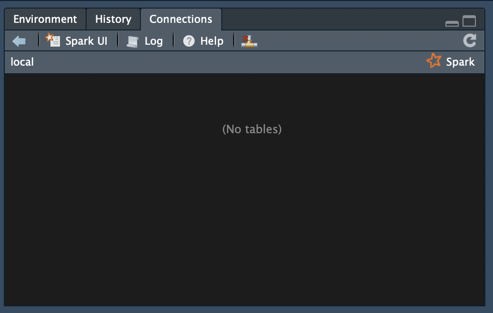

***

0

***

Install R

Install RStudio

Install Java

Download a **Very Large** dataset:
https://www.dropbox.com/s/5a210w7zhm5a97p/alleen_personenauto.csv.zip?dl=0 

Git repository
`git clone https://github.com/ArieTwigt/sparklyrintro.git`


***

1. ### Spark

***

**"Unified analytics engine for large-scale data processing"**


Developed by **Matei Zaharia** at **UC Berkeley's AMPLab** in 2009

Donated in 2012 to the Apache Software foundation **-->** Apache Spark

Founders of Apache Spark -- > **Databricks**


***

# Only use Spark if you are doing really big stuff!

Otherwise:

Python:

* **Pandas**
* **C++**

R:

* **dplyr**
* **data.table**
* **C++**


***


***

2. ### Organizations using Spark

***


Companies dealing with very large amounts of data...


***

3. ### Divide and conquer

***

***Local*** mode or ***Cluster*** mode


***

4. ### Bindings

***

Spark is written in Scala --> Lives in a JVM

Scala, Java, Python, R

*** API's? ***


***

5. ### R: Statistical Programming Language

***

R: Statistical programming language:
Introduction course/book: https://growyourdataskills.com/r_programmeren/ 

R and Spark


***

6. ### Data wrangling in R with *dplyr*

***


Introduction with examples:

https://cran.r-project.org/web/packages/dplyr/vignettes/dplyr.html


***

7. ### SparklyR


***

*Spark* + *dplyr* = ***sparklyR***

Working with large datasets in the *dplyr* syntax.

** Spark has never been that easy**

Cheatsheets available:

* **dplyr** cheatsheet: https://github.com/rstudio/cheatsheets/raw/master/sparklyr.pdf 
* **sparklyr** cheatsheet: https://github.com/rstudio/cheatsheets/raw/master/data-transformation.pdf


***

8. Let's Play

***


***

9. Installing Spark

***


Open R and RStudio --> Create a new project 

Install the `sparklyr` package in **R**

```{r, eval = FALSE}
install.packages("sparklyr")
```

Open the `sparklyr` package

```{r}
library(sparklyr)
```

Check the available Spark versions

```{r}
versions <- spark_available_versions()$spark
print(versions)
```

Install the latest spark version

```{r, eval = FALSE}
latest_version <- tail(versions, 1)
print(paste0("Installing Spark version: ", latest_version))
spark_install(version="2.3.1")
```

***

10. Initating Spark: Spark Context (sc)

***

Configurations


```{r}
sc <- spark_connect(master = "local", 
                    app_name = "ariespark")
```

If this works, you got Spark installed!

You also get this nice little Spark pane in RStudio



Other configurations:

```{r}
library(parallel)
detectCores()
```

Check configuration

```{r, eval = FALSE}
config <- spark_config()
config
```

Change configuration

```{r, eval = FALSE}
config$sparklyr.connect.cores.local <- 4
config$`sparklyr.shell.driver-memory` <- "2g"
config$`sparklyr.shell.executor-memory` <- "2g"
config$`spark.yarn.executor.memoryOverhead` <- "1g"
config
```


***

11. RDD's

***


**Resilient distributed dataset (RDD)**

*"A collection of elements partitioned across the nodes of the cluster that can be operated on in parallel."*


**Immutable**


**Two types of operations on RDD's:**

* Transformations: Construct a new RDD from an old one
* Actions: Compute result based on an RDD


You don't care in sparklyr because you just use the *dplyr* syntax 😎

But you should monitor the performance.

***

12. Spark UI

***

Monitor what is sparklyr doing with Spark under the hood:

* Execution time of operations
* Lineage graphs
* Capacities

http://localhost:4040 


***

13. Import data in R

***

1. Copy table to R
2. Copy table to Spark 

Read large csv-files in R faster with data.table:

`import data into RStudio`


```{r}
library(readr)
alleen_personenauto_filtered <- read_csv("data/alleen_personenauto_filtered.csv")
```


Check the dataset

```{r}
dim(alleen_personenauto_filtered)
```

***

14. Import data to Spark

***


`copy_to()` from `dplyr`

```{r}
library(dplyr)
```


```{r}
start <- Sys.time()
copy_to(sc, alleen_personenauto_filtered)
end <- Sys.time()
end - start
```


Data wrangling with **dplyr**

Notice the `%>%` piping

```{r}
auto_merken <- alleen_personenauto_filtered %>%
              group_by(Merk) %>%
              summarise(aantal = n()) %>%
              filter(aantal > 100) %>%
              arrange(desc(aantal))
```


```{r}
library(ggplot2)
autos_merk_plot <- qplot(Merk, data=head(auto_merken, 25), geom="bar", weight=aantal, ylab="aantal") + theme(axis.text.x = element_text(angle = 90, hjust = 1))
autos_merk_plot
```


```{r}
auto_carrosserie <- alleen_personenauto_filtered %>%
              group_by(Inrichting) %>%
              summarise(aantal = n()) %>%
              filter(aantal > 100) %>%
              arrange(aantal, desc(-aantal))
```

```{r}
autos_carrosserie_plot <- qplot(Inrichting, data=tail(auto_carrosserie, 50), geom="bar", weight=aantal, ylab="aantal") + theme(axis.text.x = element_text(angle = 90, hjust = 1)) 
autos_carrosserie_plot
```


***

End of Part 1

Go Play :) with the dplyr syntax. In the next part we are going to play with some larger dataset and some prediction models.

***


***

# Part 2, working with some really large datasets

***

Clear your environment and restart **R**

*Session*  --> *Terminate R*

If there are still elements in the **Environment** tab, execute:

```{r}
remove(list = ls())
```


### Open the required packages


```{r}
library(dplyr)
library(sparklyr)
```


This time, we want some more power. We are going to overrule the default settings of the **Spark** Config


```{r}
config = spark_config()
config$`sparklyr.shell.driver-memory` <- "6G"
config$`sparklyr.shell.executor-memory` <- "6G"
config$`spark.yarn.executor.memoryOverhead` <- "2G"
```

We set up a Spark connection

```{r}
sc <- spark_connect("local", 
                   # version = "2.1.0", # Uncomment if you like to choose a specific version
                    config = config)
```


Import the real dataset, 2.96 GB in-memory😳😳😳. This time, we use the `spark_read_csv()` function. This will import the dataset as an *RDD* in Spark and not in R. It will take a few minutes and you will hear your machine putting in some serious work 💻

```{r}
start <- Sys.time()

spark_read_csv(sc, 
               name = "alleen_personenauto", 
               path = "data/alleen_personenauto.csv")

end <- Sys.time()
```


Recall that the object ***alleen_personenauto*** is not present in the *Environment* tab in RStudio, but only in the *Connections* tab. We loaded the data directly from the csv-file into Spark. 

> Question: what is the advantage of this approach?

Is it really not available in R??

```{r, eval = FALSE}
dim(alleen_personenauto)
```

Yes, it is really not available.

It is in Spark:


```{r}
src_tbls(sc)
```

Check the Spark UI: http://localhost:4040 

There is our dataset. Check the ***Cached Partitions*** value.


Or data is divided into 23 smaller sets. Hence the name **Resilient Distributed Dataset** --> Distributed. 


How did Spark do this? Check out the **Jobs** tab in the *Spark UI.*


Time to work with the data. Use our R skills to work with the large dataset that currently lives in Spark.


Read into R with the `tbl()` function.

```{r}
tbl_autos <- tbl(sc, "alleen_personenauto")
```


Wow that was fast!!!! Almost 3 GB loaded from Spark into the RSession. 
...
...
...
Wait ....... did we really load the data into R? 🤔

```{r}
tbl_autos
```

Yes, we got the data right?


Let's filter the data like we did with the smaller dataset.

```{r}
audis <- tbl_autos %>%
  filter(Merk == "AUDI")
```

No problem, we got all the *Audi's* now.

```{r}
head(audis)
```

So, show me the average price

```{r}
mean(as.numeric(audis$Catalogusprijs), na.rm = TRUE)
```

"Not a Number"??

Just show me a column than?

```{r}
audis$Kenteken
```
 
 **NULL**? 😨 What is this kind of crappy data frame?
 
```{r}
 class(audis)
```


--> `tbl_lazy`. ---> Resilient. It will execute only if we tell him to execute something.

Execute Spark --> Now spark will work for you. You will hear your machine work again. We collect the `audis` set and saved is as an R **data frame** object.

```{r}
audis_df <- collect(audis)
```

```{r}
mean(as.numeric(audis_df$Catalogusprijs), na.rm = TRUE)
```


Now we have our price. Wait... that is some crappy format, let's work on that later.

Let's get all the station cars:


```{r}
audis_stations_df <- audis_df %>%
  filter(Inrichting == "stationwagen")
```


> Question, are we using Spark or regular R here?


### Find your car

```{r}
mycar <- tbl_autos %>%
  filter(Kenteken == "TB725F")
```

```{r}
mycar_df <- collect(mycar)
```


### Machine Learning in SparklyR


Check available features

```{r}
str(audis_stations_df)
```

```{r}
audis_clean <- audis %>%
  mutate(Catalogusprijs = regexp_replace(Catalogusprijs, ",", ".")) %>% # regex
  mutate(Catalogusprijs = as.numeric(Catalogusprijs)) %>% # convert columns
  select(Catalogusprijs, Aantal_cilinders) %>% # select columns
  na.omit() # remove rows with empty values ('NA', 'NaN' etc.)
```

> Question, are we using Spark or regular R here?


# predict price per cilinder

```{r}
lm_model_1 <- audis_clean %>%
  ml_linear_regression(Catalogusprijs ~ Aantal_cilinders) 
```

Show model performance

```{r}
summary(lm_model_1)
```


New model, importing cars cheaper?

```{r}
audis_clean <- audis %>%
  mutate(Catalogusprijs = regexp_replace(Catalogusprijs, ",", ".")) %>% # regex
  mutate(Catalogusprijs = as.numeric(Catalogusprijs)) %>% # convert columns
  select(Catalogusprijs, Aantal_cilinders, Export_indicator) %>% # select columns
  na.omit() # remove rows with empty values ('NA', 'NaN' etc.)

```

# predict price per cilinder added with export indicator

```{r}
lm_model_2 <- audis_clean %>%
  ml_linear_regression(Catalogusprijs ~ Aantal_cilinders + Export_indicator) 
```

Show model performance

```{r}
summary(lm_model_2)
```


### Classification model

```{r}
ferraris_maseratis <- tbl_autos %>%
  filter(Merk %in% c("FERRARI", "MASERATI"))
```


